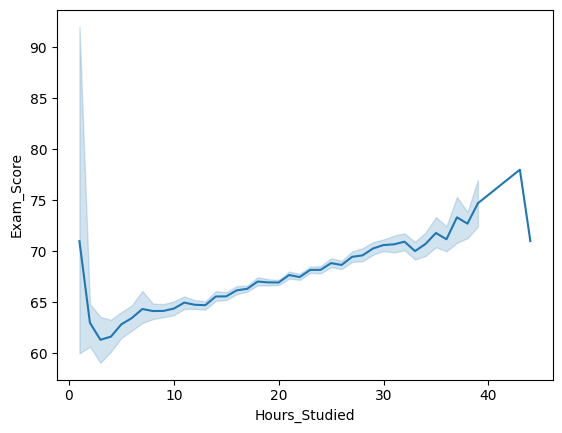
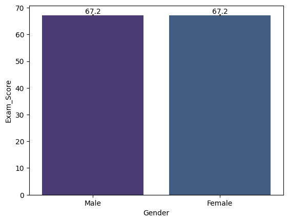
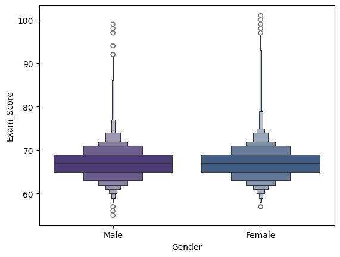
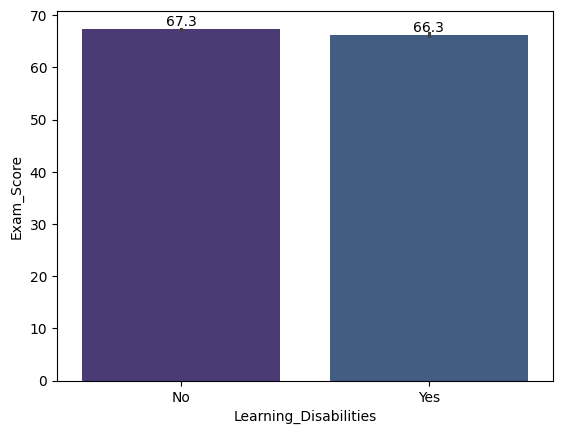
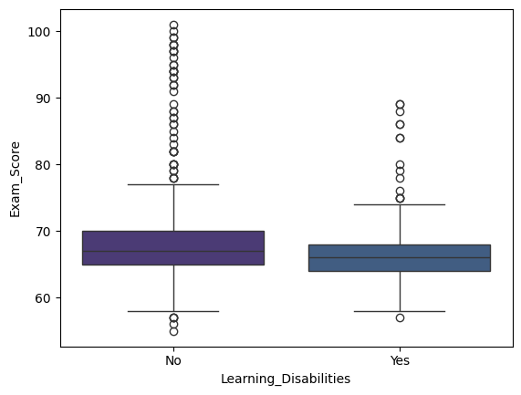
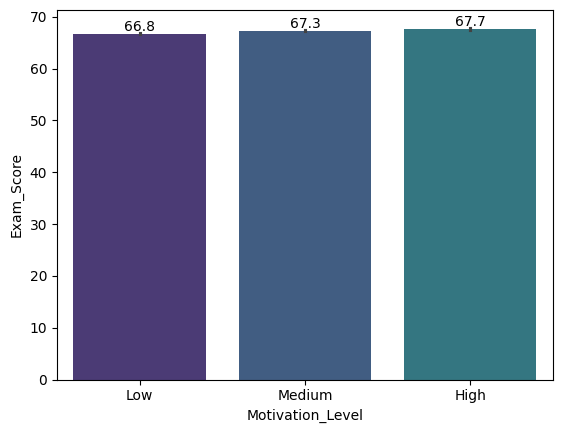
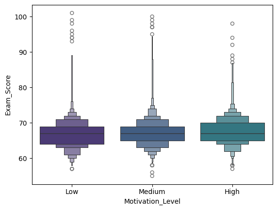

# Relatório dos Dados

Interessante observar a forma que as notas crescem acompanhando as horas de estudo, mas o que chama a atenção é o pico inicial da média para poucas horas de estudo.

Isso provavelmente se deve aos alunos que apesar de não se esforçarem fora da escola, sempre tiveram notas boas, como este que vos fala.

| Gráfico de linha das notas em relação às horas de estudo |
|:-:|
|  |

&nbsp;

&nbsp;

&nbsp;

&nbsp;

&nbsp;

&nbsp;

&nbsp;

&nbsp;

&nbsp;

É possível perceber que as médias das notas dos alunos, em geral, não são afetadas pelo gênero.

| Gráfico de Barras da média por gênero | Boxplot aprimorado das notas por gênero |
|:-:|:-:|
|  |  |

&nbsp;

Dificulades de aprendizado, ao contrário do que se imagina, trouxeram uma diferença pequena nas notas.

| Gráfico de barras da média das notas por dificuldade de aprendizado | Boxplot das notas por dificuldade de aprendizado |
|:-:|:-:|
|||

&nbsp;

&nbsp;

&nbsp;

&nbsp;

&nbsp;

&nbsp;

&nbsp;

O nível de motivação é um fator que tende a influenciar no desempenho de um aluno, isso pode ser observado pela média sequencial gradual por nível (Baixo, Médio, Alto).

|Gráfico de barras da média dos alunos por nível de motivação|Boxplot das notas por nível de motivação|
|:-:|:-:|
|||
